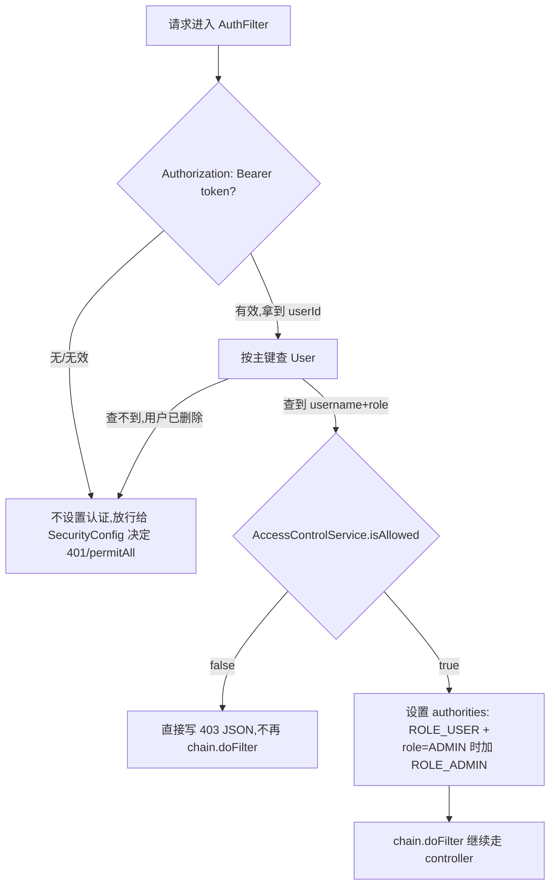

# 管理员访问控制 设计文档

**目标**：加一个管理员页面，第一个功能是全局访问控制——控制"是否开放注册/登录/使用"，默认只允许管理员（`adam`）使用，管理员可切换为"全部开放"或"白名单（按用户名，预批准制）"。

**背景**：生产环境目前只有 `adam` 一个已注册用户，还不想对外开放。需要一个运行时可调整（不需要重新部署）的开关，且切换后要对已登录用户立即生效，不能等 token 自然过期（默认 1 小时）。

---

## 1. 数据模型

新增 Flyway 迁移 `V9__admin_access_control.sql`（H2 + MySQL 各一份，跟 V1-V8 一致的双份写法）：

```sql
ALTER TABLE `user` ADD COLUMN role VARCHAR(20) NOT NULL DEFAULT 'USER';
UPDATE `user` SET role = 'ADMIN' WHERE username = 'adam';

CREATE TABLE app_setting (
  setting_key   VARCHAR(64)  PRIMARY KEY,
  setting_value VARCHAR(255) NOT NULL,
  update_time   DATETIME
);
INSERT INTO app_setting (setting_key, setting_value, update_time)
  VALUES ('access_mode', 'ADMIN_ONLY', NOW());

CREATE TABLE access_whitelist (
  username    VARCHAR(64) PRIMARY KEY,
  create_time DATETIME
);
```

- `role`：`USER`（默认）/ `ADMIN` 两个取值，`User` 实体加 `private String role`。支持未来多管理员——直接改这一列即可，不需要新建表。
- `app_setting`：通用 key-value 设置表，为"管理页面"未来其它功能（不只是访问控制）预留扩展位；本功能只用到一行 `access_mode`。
- `access_whitelist`：一行一个允许注册/登录/使用的用户名，预批准制——管理员可以把还没注册过的用户名先加进去。
- **已知边界情况**：`UPDATE ... WHERE username='adam'` 依赖这行迁移在 `adam` 已注册之后跑，生产环境成立；如果未来在全新环境（无 `.env`，首次部署）重放这批迁移，这条 UPDATE 会静默无效果（`adam` 还不存在），需要人工手动把某个用户提为 `ADMIN`。这是可接受的边界情况，不需要额外处理。

---

## 2. 后端强制点

### AccessControlService（新类）

单实例部署（无需考虑多节点缓存一致性）。启动时把 `access_mode` 和 `access_whitelist` 全量读进两个 `volatile` 字段；管理端写操作直接更新数据库 + 同步刷新这两个字段，读路径全程不查库。

```java
boolean isAllowed(String username, String role) {
    if ("ADMIN".equals(role)) return true;
    return switch (currentMode) {
        case "OPEN" -> true;
        case "WHITELIST" -> whitelistCache.contains(username);
        default -> false; // ADMIN_ONLY
    };
}
```

### AuthFilter 改造

解出 `userId` 后新增一步：按主键查 `User`（索引查询，量级可忽略）拿到当前真实 `username`/`role`——不依赖 JWT 里的旧 claim，用户被删/改名/改角色都实时生效。



403 响应体沿用现有错误体格式：`{"error":"access_restricted","message":"..."}`。

### 注册/登录改造

- `UserController.register`：先查 `AccessControlService.isAllowed(username, "USER")`（新用户不可能是 ADMIN）。不通过 → 403 `access_restricted`。
- `UserController.login`：先查到已有用户的 `role`，再判断 `isAllowed`。不通过 → 403 `access_restricted`。

### 新增 AdminController（`/api/admin/**`）

`SecurityConfig` 加一条 `requestMatchers("/api/admin/**").hasRole("ADMIN")`。

| 方法 | 路径 | 说明 |
|---|---|---|
| GET | `/api/admin/access-setting` | 返回当前 mode + 白名单列表 |
| PUT | `/api/admin/access-setting` | body `{mode}`，切换模式 |
| POST | `/api/admin/whitelist` | body `{username}`，加白名单 |
| DELETE | `/api/admin/whitelist/{username}` | 移除白名单 |

---

## 3. 前端

- **`@cnotes/types`**：`AuthToken` 加 `role` 字段；新增 `AccessMode = 'ADMIN_ONLY' | 'OPEN' | 'WHITELIST'`、`AccessSetting { mode: AccessMode; whitelist: string[] }`。
- **`@cnotes/api-client`**：
  - 仿 `getToken`/`setToken` 加 `getRole`/`setRole`（新 localStorage key），登录/注册成功后一起存。
  - `CnotesClient` 接口加 `getAccessSetting()` / `updateAccessSetting(mode)` / `addWhitelistUser(username)` / `removeWhitelistUser(username)`。
  - `request()` 里 403 特殊处理：解析 body，若 `error === 'access_restricted'`，与 401 同样全局踢出（清 token + role，跳转到一个专门的"访问受限"提示页/状态），而不是冒泡成普通业务错误——避免用户误以为是密码错。其它原因的 403（目前没有）不受影响，正常冒泡。
- **路由**（`router.ts`）：新增顶层路由 `/admin` → 新建 `AdminView.vue`，与 `/login`/`/register`/`/` 同级；导航守卫加一条：非 ADMIN 角色访问 `/admin` 重定向 `/`。
- **导航入口**：`HomeView.vue` 顶部 `topbar` 里，`getRole() === 'ADMIN'` 时渲染一个"⚙ 管理"按钮，点击 `router.push('/admin')`；非管理员完全看不到这个入口。
- **`AdminView.vue`**（新页面）：三选一模式切换（管理员专属 / 全部开放 / 白名单）+ 白名单模式下展开用户名列表（输入框 + "添加"按钮、每行一个"移除"按钮）。每次操作即时调用对应 API 生效（不设单独的"保存"按钮，跟后端"立即切断"的语义一致），用现有 `Toast` 组件提示成功/失败；顶部"‹ 返回"按钮回 `/`。

---

## 4. 测试

**后端**：
- `AccessControlServiceTest`：三种模式下 `isAllowed` 判断矩阵（含 ADMIN 角色永远放行）。
- `AuthFilter` 集成测试：三种模式下普通用户请求受保护接口的 200/403；ADMIN 用户始终 200；403 body 校验。
- `UserController` 注册/登录测试：三种模式下允许/拒绝组合（含白名单预批准注册）。
- `AdminController` 测试：非 ADMIN 访问 `/api/admin/**` 应 403；ADMIN 增删白名单、切换模式应生效且能查回。

**前端**：实现完成后在浏览器里手动过一遍——登录 `adam` 看到"管理"入口、进 `/admin` 切三种模式、白名单增删、用非 `adam` 账号验证被踢时全局跳到访问受限页。

---

## 5. 上线影响

部署后默认 `ADMIN_ONLY`，只有 `adam` 能用；其他人的开放需要 `adam` 登录管理页面手动切换模式或加白名单。这是本次改动**明确希望达成**的行为（现在生产库只有 `adam` 一个用户，不会误伤任何人）。
