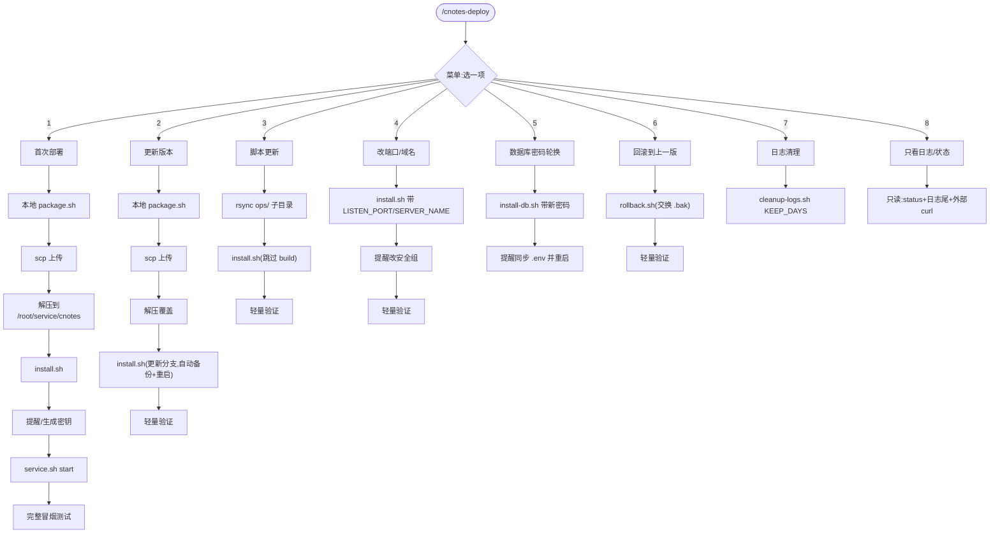

# cnotes-deploy Skill 设计文档

> 目的:把本次会话里手工做过的"本地编译打包 → 上传远程 → 安装/更新 → 验证"整套流程,沉淀成一个
> 可在未来任意新会话里复用的 Claude Code project skill——`/cnotes-deploy`。

## 1. 整体形态

**位置**:
- `.claude/skills/cnotes-deploy/SKILL.md`(主体,与现有 `phased-dev` 同级)
- `.claude/commands/cnotes-deploy.md`(触发词,`disable-model-invocation: true`,只能主动 `/cnotes-deploy` 调用,不被模型联想自动触发——部署是有风险的动作,不适合被动触发)

**写死的项目专属常量**(不做成每次询问的参数):
- SSH 别名:`aliyun`
- 远程部署目录:`/root/service/cnotes`
- 当前 nginx 监听端口:`38088`

**执行方式**:菜单式——调用后先列 8 个选项,用户选哪个就只执行对应那一段流程,不是每次全跑一遍。

## 2. 首次部署 / 更新版本(含新增备份逻辑)

**首次部署**:
1. 本地 `ops/scripts/package.sh`(build 后端+前端,打包 tar.gz)
2. `scp` 上传到 `aliyun:/root/docs/upload/`
3. `ssh` 解压:`mkdir -p /root/service/cnotes && tar xzf <包> -C /root/service/cnotes --strip-components=1`
4. `ssh` 跑 `./scripts/install.sh`(建库、生成 `.env`、装 systemd+nginx)
5. 提醒手工填 `DEEPSEEK_API_KEY`/`ARK_API_KEY`;`JWT_SECRET` 可以直接 `openssl rand -hex 32` 生成,不用等用户
6. `./scripts/service.sh start`
7. 完整冒烟测试:注册 → 提交文章 → 等 AI 处理完 → 确认 summary/keyPoints 真实生成 → 清理测试数据

**更新版本**:同样 build+package+上传+解压覆盖,`install.sh` 检测到 `.env` 已存在走更新分支:跳过建库、不碰 `.env`、自动重启。

**新增备份逻辑(为回滚铺路,改 `install.sh`)**:在"部署后端 jar"和"部署前端静态产物"两步,判断是更新场景(`.env` 已存在)且旧文件存在时,先备份再覆盖:
- `cnotes.jar` → `cnotes.jar.bak`
- `/var/www/cnotes/dist/` → `/var/www/cnotes/dist.bak/`

首次安装没有旧版本,不做这个备份动作。

## 3. 脚本更新 / 改端口域名 / 密码轮换

**脚本更新**(只改了 `ops/` 下脚本/配置模板,代码没动):`rsync` 同步 `ops/scripts`、`ops/systemd`、`ops/nginx`、`ops/env`、`ops/sql` 到远程对应子目录(几十 KB,秒级),然后照样跑 `./scripts/install.sh`。`backend/`、`frontend/` 没变,重跑那两步只是本地磁盘原地复制,零网络成本。

**顺带修复的真实坑**:`install.sh` 现状是每次重跑,`LISTEN_PORT`/`SERVER_NAME` 不显式传就回退默认 `80`/`_`,会**静默改回默认端口**。修复:没显式传这两个变量时,优先读**当前** `/etc/nginx/conf.d/cnotes.conf` 里已生效的 `listen`/`server_name` 值作为默认值,读不到(首次安装)才落回硬编码默认。

**改端口/域名**:重跑 `install.sh` 带 `LISTEN_PORT=xxx` 或 `SERVER_NAME=xxx`,提醒去安全组放行对应端口。

**数据库密码轮换**:`DB_PASSWORD=<新密码> ./scripts/install-db.sh`,提醒手工同步 `.env` 的 `SPRING_DATASOURCE_PASSWORD` 并重启。

## 4. 回滚 / 日志清理 / 只看状态

**回滚到上一版**——新增 `ops/scripts/rollback.sh`:
1. 检查 `cnotes.jar.bak`/`dist.bak/` 是否存在,不存在明确报错。
2. 停服务。
3. **交换名字**而不是单向覆盖:`cnotes.jar` ↔ `cnotes.jar.bak`(`dist/` ↔ `dist.bak/` 同理)。好处:再跑一次 `rollback.sh` 等于把刚换下去的版本换回来,两版之间来回切换,不用另写"回滚的回滚"。
4. 重启,输出状态确认。

**日志清理**——新增 `ops/scripts/cleanup-logs.sh KEEP_DAYS`(默认 14,可传参):
- 后端:`find /root/service/cnotes/logs -name '*.gz' -mtime +N -delete`(当前活跃的 `cnotes.log`/`cnotes-error.log` 文件名不带日期后缀,天然不会被误删)。
- nginx:同样按 `-mtime +N` 清理 `/var/log/nginx/` 下的滚动历史文件(`*.gz`、`*.log.[0-9]*`),不碰活跃的 `access.log`/`error.log`。
- nginx 日志目前轮转依赖系统默认 logrotate(不是按天生成带日期文件名),后续要配 crontab 做按天切割——**这部分不在本 skill 范围内,后续单独处理**。
- 清理完打印删了哪些文件、腾出多少空间。

**只看日志/状态**——不新增脚本,纯只读:`systemctl status cnotes` + `tail` 日志文件 + `journalctl -u cnotes -n 50` + 外部 `curl` 连通性检查。

## 5. SKILL.md 结构与验证深度

**文件**:
- `.claude/skills/cnotes-deploy/SKILL.md`:frontmatter 只有 `name`+`description`;正文开头写死三个常量,然后 8 个菜单项各自的具体命令序列,详细到全新会话(无本次对话记忆)也能照做对。
- `.claude/commands/cnotes-deploy.md`:照抄 `phased-dev.md` 的极简模式。

**验证深度按场景区分**:
- 首次部署:完整冒烟测试(真跑一遍 AI 流水线,证明链路通)。
- 更新版本/脚本更新/改端口/回滚:轻量验证(`systemctl status` + 外部 `curl` 200 + 扫日志有没有新 error),不必每次真跑 AI 流水线烧 DeepSeek/Ark 调用额度。
- 密码轮换:轻量验证,重点看服务重启后状态正常。

## 6. 新增/修改文件清单

| 文件 | 动作 |
|---|---|
| `ops/scripts/rollback.sh` | 新增 |
| `ops/scripts/cleanup-logs.sh` | 新增 |
| `ops/scripts/install.sh` | 修改:备份逻辑 + LISTEN_PORT/SERVER_NAME 读现有配置兜底 |
| `.claude/skills/cnotes-deploy/SKILL.md` | 新增 |
| `.claude/commands/cnotes-deploy.md` | 新增 |
