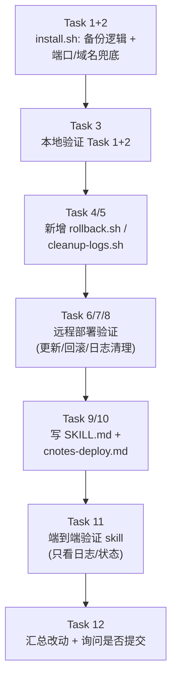

# cnotes-deploy Skill Implementation Plan

> **For Claude:** REQUIRED SUB-SKILL: Use superpowers:executing-plans to implement this plan task-by-task.

**Goal:** 把本次会话手工做过的"本地打包 → 上传远程 → 安装/更新/回滚/清日志/看状态"整套流程,固化成
`.claude/skills/cnotes-deploy/` 的项目级 skill,通过 `/cnotes-deploy` 触发,菜单式选择要执行哪一段。

**Architecture:** 复用已有的 `ops/scripts/{package,install,install-db,service}.sh`;新增
`ops/scripts/{rollback,cleanup-logs}.sh` 两个脚本;修改 `ops/scripts/install.sh` 补上"更新前自动备份"
和"端口/域名不传参时读现有配置兜底"两处逻辑;最后写 `SKILL.md` 把 8 个菜单项的具体命令串起来。

**Tech Stack:** Bash(生产机 Ubuntu 26 + GNU coreutils/find/sed),SSH 别名 `aliyun`,远程部署目录
`/root/service/cnotes`,Claude Code project skill/command 机制。

**关于提交:** 用户全局约定"没有明确允许不要 git commit/push"。本计划**不在每个任务后提交**,所有任务
做完、本地+远程都验证通过后,在最后一个任务里显式询问用户是否要提交,不要在中途擅自提交。

## 任务顺序



---

### Task 1: install.sh —— 更新前自动备份 jar 与前端 dist

**Files:**
- Modify: `ops/scripts/install.sh:45-49`

**背景**:当前这两行在"部署后端 jar"/"部署前端静态产物"两步会直接覆盖旧文件,没有留任何备份,
导致回滚(Task 4)没有东西可退。`$FRESH_ENV` 变量在脚本第 40 行已经算好(`.env` 已存在=更新,
不存在=首次安装),这里复用它判断"是不是更新场景、有没有旧文件值得备份"。

**Step 1: 修改这两段**

把现在的:
```bash
step "部署后端 jar"
install -m 644 "$PKG_ROOT/backend/cnotes.jar" "$INSTALL_DIR/cnotes.jar"

step "部署前端静态产物"
rsync -a --delete "$PKG_ROOT/frontend/dist/" "$WEB_DIR/"
```
改成:
```bash
step "部署后端 jar"
if [ "$FRESH_ENV" -eq 0 ] && [ -f "$INSTALL_DIR/cnotes.jar" ]; then
  cp "$INSTALL_DIR/cnotes.jar" "$INSTALL_DIR/cnotes.jar.bak"
fi
install -m 644 "$PKG_ROOT/backend/cnotes.jar" "$INSTALL_DIR/cnotes.jar"

step "部署前端静态产物"
if [ "$FRESH_ENV" -eq 0 ] && [ -d "$WEB_DIR" ] && [ -n "$(ls -A "$WEB_DIR" 2>/dev/null)" ]; then
  rsync -a --delete "$WEB_DIR/" "$WEB_DIR.bak/"
fi
rsync -a --delete "$PKG_ROOT/frontend/dist/" "$WEB_DIR/"
```

**Step 2: 语法检查**

Run: `bash -n ops/scripts/install.sh`
Expected: 无输出(退出码 0)

---

### Task 2: install.sh —— LISTEN_PORT/SERVER_NAME 不传参时读现有配置兜底

**Files:**
- Modify: `ops/scripts/install.sh:24-29`(删两行)
- Modify: `ops/scripts/install.sh:100-111`(原"安装 nginx 站点配置"段,插入兜底逻辑)

**背景**:现状第 27-28 行在脚本一开头就把 `SERVER_NAME`/`LISTEN_PORT` 用 `${VAR:-默认值}` 定死了,
等到第 100 行附近真正用到 `NGINX_CONF` 时已经来不及读文件反推默认值。要把"没传参时的默认值来源"从
硬编码,改成"优先读当前 `/etc/nginx/conf.d/cnotes.conf` 里已生效的值",这样重跑 `install.sh`(比如
Task 7 的"脚本更新"流程)不传这两个变量也不会把已经改过的端口/域名静默复位。

**Step 1: 删掉开头的两行默认值赋值**

把:
```bash
PKG_ROOT="$(cd "$(dirname "${BASH_SOURCE[0]}")/.." && pwd)"
INSTALL_DIR=/root/service/cnotes
WEB_DIR=/var/www/cnotes/dist
SERVER_NAME="${SERVER_NAME:-_}"
LISTEN_PORT="${LISTEN_PORT:-80}"
ENV_FILE="$INSTALL_DIR/.env"
```
改成(去掉两行默认值,留到 nginx 段再决定):
```bash
PKG_ROOT="$(cd "$(dirname "${BASH_SOURCE[0]}")/.." && pwd)"
INSTALL_DIR=/root/service/cnotes
WEB_DIR=/var/www/cnotes/dist
ENV_FILE="$INSTALL_DIR/.env"
```

**Step 2: 在 nginx 段开头插入兜底逻辑**

把现在的:
```bash
step "安装 nginx 站点配置"
mkdir -p /etc/nginx/conf.d
NGINX_CONF=/etc/nginx/conf.d/cnotes.conf
NGINX_CONF_BAK=""
```
改成:
```bash
step "安装 nginx 站点配置"
mkdir -p /etc/nginx/conf.d
NGINX_CONF=/etc/nginx/conf.d/cnotes.conf

# 没显式传 SERVER_NAME/LISTEN_PORT 时,优先读当前已生效配置作为默认值,避免重跑 install.sh
# (比如只同步了脚本、没重新指定端口)时把已经改过的设置静默覆盖回硬编码默认值。
if [ -z "${SERVER_NAME:-}" ] && [ -f "$NGINX_CONF" ]; then
  SERVER_NAME="$(grep -m1 -oE 'server_name +[^;]+' "$NGINX_CONF" | sed -E 's/server_name +//')"
fi
SERVER_NAME="${SERVER_NAME:-_}"

if [ -z "${LISTEN_PORT:-}" ] && [ -f "$NGINX_CONF" ]; then
  LISTEN_PORT="$(grep -m1 -oE 'listen +[0-9]+' "$NGINX_CONF" | grep -oE '[0-9]+')"
fi
LISTEN_PORT="${LISTEN_PORT:-80}"

NGINX_CONF_BAK=""
```

**Step 3: 语法检查**

Run: `bash -n ops/scripts/install.sh`
Expected: 无输出(退出码 0)

---

### Task 3: 本地验证 Task 1+2(不碰远程)

**Files:** 无新文件,纯验证

**Step 1: 验证备份逻辑的条件判断**(用假目录模拟,不依赖真实 install.sh 跑通全流程)

```bash
mkdir -p /tmp/backup_test/install_dir
echo "old-jar-content" > /tmp/backup_test/install_dir/cnotes.jar
FRESH_ENV=0
if [ "$FRESH_ENV" -eq 0 ] && [ -f /tmp/backup_test/install_dir/cnotes.jar ]; then
  cp /tmp/backup_test/install_dir/cnotes.jar /tmp/backup_test/install_dir/cnotes.jar.bak
fi
cat /tmp/backup_test/install_dir/cnotes.jar.bak
rm -rf /tmp/backup_test
```
Expected: 输出 `old-jar-content`,证明条件成立时正确备份。

**Step 2: 验证端口兜底逻辑**

```bash
mkdir -p /tmp/port_test
cat > /tmp/port_test/cnotes.conf <<'EOF'
server {
    listen 38088;
    server_name _;
EOF
unset LISTEN_PORT SERVER_NAME
NGINX_CONF=/tmp/port_test/cnotes.conf
if [ -z "${SERVER_NAME:-}" ] && [ -f "$NGINX_CONF" ]; then
  SERVER_NAME="$(grep -m1 -oE 'server_name +[^;]+' "$NGINX_CONF" | sed -E 's/server_name +//')"
fi
SERVER_NAME="${SERVER_NAME:-_}"
if [ -z "${LISTEN_PORT:-}" ] && [ -f "$NGINX_CONF" ]; then
  LISTEN_PORT="$(grep -m1 -oE 'listen +[0-9]+' "$NGINX_CONF" | grep -oE '[0-9]+')"
fi
LISTEN_PORT="${LISTEN_PORT:-80}"
echo "SERVER_NAME=$SERVER_NAME LISTEN_PORT=$LISTEN_PORT"
rm -rf /tmp/port_test
```
Expected: `SERVER_NAME=_ LISTEN_PORT=38088`(证明没传参时读到了已有配置的 38088,不是硬编码的 80)。

---

### Task 4: 新增 ops/scripts/rollback.sh

**Files:**
- Create: `ops/scripts/rollback.sh`

**Step 1: 写文件**

```bash
#!/usr/bin/env bash
# ops/scripts/rollback.sh —— 把 cnotes.jar / 前端 dist 与各自的 .bak 互换,回滚到上一版本。
# 仅支持 1 层历史(install.sh 每次"更新"部署前会自动把当前版本备份成 .bak,见 install.sh)。
# 用的是交换而不是单向覆盖:再跑一次本脚本,等于把刚换下去的版本换回来,两版之间来回切换,
# 不需要另外实现"回滚的回滚"。
# 用法(生产机,root/sudo):
#   sudo ./scripts/rollback.sh
set -euo pipefail

[ "$(id -u)" -eq 0 ] || { echo "请用 sudo/root 运行本脚本" >&2; exit 1; }

INSTALL_DIR=/root/service/cnotes
WEB_DIR=/var/www/cnotes/dist

JAR="$INSTALL_DIR/cnotes.jar"
JAR_BAK="$INSTALL_DIR/cnotes.jar.bak"
DIST_BAK="${WEB_DIR}.bak"

[ -f "$JAR_BAK" ] || { echo "没有可回滚的备份($JAR_BAK 不存在),可能还没做过一次更新部署" >&2; exit 1; }
[ -d "$DIST_BAK" ] || { echo "没有可回滚的前端备份($DIST_BAK 不存在)" >&2; exit 1; }

step(){ printf '\n\033[1;36m== %s ==\033[0m\n' "$*"; }

step "停止服务"
systemctl stop cnotes

step "交换 jar"
TMP_JAR="$(mktemp "$INSTALL_DIR/.cnotes.jar.swap.XXXXXX")"
mv "$JAR" "$TMP_JAR"
mv "$JAR_BAK" "$JAR"
mv "$TMP_JAR" "$JAR_BAK"

step "交换前端 dist"
TMP_DIST="${WEB_DIR}.swap-tmp"
rm -rf "$TMP_DIST"
mv "$WEB_DIR" "$TMP_DIST"
mv "$DIST_BAK" "$WEB_DIR"
mv "$TMP_DIST" "$DIST_BAK"

step "重启服务"
systemctl start cnotes
sleep 3
systemctl --no-pager -l status cnotes | head -15

echo
echo "已切换到备份版本(再跑一次 rollback.sh 可以切回来)。"
```

**Step 2: 权限+语法检查**

Run: `chmod +x ops/scripts/rollback.sh && bash -n ops/scripts/rollback.sh`
Expected: 无输出(退出码 0)

---

### Task 5: 新增 ops/scripts/cleanup-logs.sh

**Files:**
- Create: `ops/scripts/cleanup-logs.sh`

**Step 1: 写文件**

```bash
#!/usr/bin/env bash
# ops/scripts/cleanup-logs.sh —— 清理超过 KEEP_DAYS 天的历史日志归档(后端 + nginx),
# 不碰当前活跃文件(cnotes.log/cnotes-error.log/access.log/error.log 文件名不带日期/序号后缀,
# 天然不会被下面的 find 匹配条件命中)。
# 用法: sudo ./scripts/cleanup-logs.sh [KEEP_DAYS]   # 不传默认 14 天
set -euo pipefail

[ "$(id -u)" -eq 0 ] || { echo "请用 sudo/root 运行本脚本" >&2; exit 1; }

KEEP_DAYS="${1:-14}"
[[ "$KEEP_DAYS" =~ ^[0-9]+$ ]] || { echo "KEEP_DAYS 必须是正整数,收到: $KEEP_DAYS" >&2; exit 1; }

BACKEND_LOG_DIR=/root/service/cnotes/logs
NGINX_LOG_DIR=/var/log/nginx

step(){ printf '\n\033[1;36m== %s ==\033[0m\n' "$*"; }

file_size() { stat -c%s "$1" 2>/dev/null || stat -f%z "$1" 2>/dev/null || echo 0; }

cleanup_dir() {
  local dir="$1" desc="$2"
  shift 2
  [ -d "$dir" ] || { echo "$desc 目录不存在,跳过: $dir"; return; }

  local count=0 freed=0 f
  while IFS= read -r -d '' f; do
    freed=$((freed + $(file_size "$f")))
    rm -f "$f"
    count=$((count + 1))
    echo "  删除: $f"
  done < <(find "$dir" \( "$@" \) -type f -mtime "+${KEEP_DAYS}" -print0)

  if [ "$count" -eq 0 ]; then
    echo "$desc:没有超过 ${KEEP_DAYS} 天的历史文件"
  else
    echo "$desc:共删除 ${count} 个文件,释放约 $((freed / 1024 / 1024))MB"
  fi
}

step "清理后端历史日志(${BACKEND_LOG_DIR},保留 ${KEEP_DAYS} 天)"
cleanup_dir "$BACKEND_LOG_DIR" "后端日志" -name '*.gz'

step "清理 nginx 历史日志(${NGINX_LOG_DIR},保留 ${KEEP_DAYS} 天)"
cleanup_dir "$NGINX_LOG_DIR" "nginx 日志" -name '*.gz' -o -name '*.log.[0-9]*'
```

**Step 2: 权限+语法检查**

Run: `chmod +x ops/scripts/cleanup-logs.sh && bash -n ops/scripts/cleanup-logs.sh`
Expected: 无输出(退出码 0)

**Step 3: 本地 dry-run(用假目录+假旧文件,不碰真实日志)**

```bash
mkdir -p /tmp/cleanup_test/logs /tmp/cleanup_test/nginx
touch -t 202501010000 /tmp/cleanup_test/logs/cnotes-2025-01-01-1.log.gz   # 很老,该删
touch /tmp/cleanup_test/logs/cnotes.log                                    # 当前活跃,不该删
touch -t 202501010000 /tmp/cleanup_test/nginx/access.log.3.gz              # 很老,该删
touch /tmp/cleanup_test/nginx/access.log                                    # 当前活跃,不该删

# 临时改 BACKEND_LOG_DIR/NGINX_LOG_DIR 指向测试目录跑一遍(不用 sudo,因为测试目录是自己的)
BACKEND_LOG_DIR=/tmp/cleanup_test/logs NGINX_LOG_DIR=/tmp/cleanup_test/nginx \
  bash -c '
    source <(sed -n "/^file_size/,/^cleanup_dir/p; /^step/p" ops/scripts/cleanup-logs.sh) 2>/dev/null || true
  '
# 更直接:临时改脚本里的路径变量跑一遍再改回来,或者手工验证 find 条件本身:
find /tmp/cleanup_test/logs \( -name '*.gz' \) -type f -mtime +1
find /tmp/cleanup_test/nginx \( -name '*.gz' -o -name '*.log.[0-9]*' \) -type f -mtime +1
rm -rf /tmp/cleanup_test
```
Expected:两条 `find` 只列出 `.gz`/`access.log.3.gz` 那两个老文件,不包含 `cnotes.log`/`access.log`。

> 上面 dry-run 的 `source <(...)` 那段仅作为思路示例,实际执行时用两条独立 `find` 命令验证匹配条件
> 即可(更直接可靠),不需要真的 source 整个脚本。

---

### Task 6: 部署到远程(用"脚本更新"流程验证 Task 1-5 的改动)

**Files:** 无新文件,操作远程 `aliyun:/root/service/cnotes`

**Step 1: 同步改过的脚本到远程**

```bash
rsync -avz ops/scripts/ aliyun:/root/service/cnotes/scripts/
```
Expected: 显示 `install.sh`(变更)、`rollback.sh`、`cleanup-logs.sh`(新增)被传输。

**Step 2: 设置执行权限**

```bash
ssh aliyun "chmod +x /root/service/cnotes/scripts/*.sh"
```

**Step 3: 跑 install.sh 走一次真实更新流程,验证备份+端口兜底都生效**

```bash
ssh aliyun "cd /root/service/cnotes && ./scripts/install.sh"
```
Expected 关注两点:
1. 输出里能看到"已有 .env,跳过建库"(走的是更新分支)
2. 服务重启后 `systemctl status cnotes` 是 `active (running)`

**Step 4: 确认备份文件真的生成了,且端口没被打回默认值**

```bash
ssh aliyun "ls -la /root/service/cnotes/cnotes.jar.bak /var/www/cnotes/dist.bak && grep listen /etc/nginx/conf.d/cnotes.conf"
```
Expected: 两个 `.bak` 都存在;`listen` 那行仍然是 `38088`(证明 Task 2 的兜底逻辑生效,没有传
`LISTEN_PORT` 却没被打回 80)。

**Step 5: 外部连通性确认**

```bash
curl -sS -m 8 -o /dev/null -w 'http_code=%{http_code}\n' http://120.77.79.151:38088/
```
Expected: `http_code=200`

---

### Task 7: 远程验证 rollback.sh(安全地测一次真实切换,再切回来)

**Files:** 无新文件

**Step 1: 记录切换前的 jar 大小(用于确认真的换了)**

```bash
ssh aliyun "ls -la /root/service/cnotes/cnotes.jar /root/service/cnotes/cnotes.jar.bak"
```

**Step 2: 执行一次回滚**

```bash
ssh aliyun "cd /root/service/cnotes && ./scripts/rollback.sh"
```
Expected: 停服务 → 交换 jar/dist → 重启服务 → `active (running)`

**Step 3: 确认外部仍可访问(证明"上一版"本身也是能跑的,因为其实就是同一个刚部署的版本)**

```bash
curl -sS -m 8 -o /dev/null -w 'http_code=%{http_code}\n' http://120.77.79.151:38088/
```
Expected: `http_code=200`

**Step 4: 再跑一次切回来(验证"回滚的回滚"这个交换特性)**

```bash
ssh aliyun "cd /root/service/cnotes && ./scripts/rollback.sh"
curl -sS -m 8 -o /dev/null -w 'http_code=%{http_code}\n' http://120.77.79.151:38088/
```
Expected: 同样 `active (running)` + `http_code=200`,证明两次 rollback 互为逆操作。

---

### Task 8: 远程验证 cleanup-logs.sh(先用大 KEEP_DAYS 确认不误删,再抽查逻辑)

**Files:** 无新文件

**Step 1: 用一个很大的 KEEP_DAYS 跑一遍,确认现在没有文件会被删(目前部署时间还很短,不应该有任何历史归档文件)**

```bash
ssh aliyun "cd /root/service/cnotes && ./scripts/cleanup-logs.sh 36500"
```
Expected: 两段都输出"没有超过 36500 天的历史文件"(因为目前压根没有滚动出的历史文件,主日志文件也不会被匹配条件命中)。

**Step 2: 确认当前活跃日志文件没有被误删**

```bash
ssh aliyun "ls -la /root/service/cnotes/logs/cnotes.log /root/service/cnotes/logs/cnotes-error.log /var/log/nginx/access.log /var/log/nginx/error.log"
```
Expected: 四个文件都还在。

---

### Task 9: 新增 .claude/skills/cnotes-deploy/SKILL.md

**Files:**
- Create: `.claude/skills/cnotes-deploy/SKILL.md`

**Step 1: 写文件**(整合本文档 Task 1-8 验证过的全部命令,按 8 个菜单项组织;frontmatter 只有
`name`+`description`;正文开头写死三个常量;每个菜单项给出完整可执行的命令序列,详细到全新会话
也能照做对;首次部署用完整冒烟测试,其余场景用轻量验证)

具体文件内容在下面"SKILL.md 完整内容"小节给出,直接照抄创建即可(内容较长,含 8 段菜单流程,是
本计划实现产出的核心交付物,执行时以该小节内容为准)。

**Step 2: 校验 frontmatter 格式**

Run: `head -5 .claude/skills/cnotes-deploy/SKILL.md`
Expected: 能看到 `---` 包裹的 `name: cnotes-deploy` 和 `description: ...` 两行。

---

### Task 10: 新增 .claude/commands/cnotes-deploy.md

**Files:**
- Create: `.claude/commands/cnotes-deploy.md`

**Step 1: 写文件**(照抄 `.claude/commands/phased-dev.md` 的极简模式)

```markdown
---
description: 部署/更新/回滚/清理 c-notes 到生产机(aliyun,/root/service/cnotes)
disable-model-invocation: true
---

Invoke the cnotes-deploy skill and follow it exactly as presented to you.
```

**Step 2: 确认能被识别**

Run: `cat .claude/commands/cnotes-deploy.md`
Expected: 内容与上面一致。

---

### Task 11: 端到端验证 skill 本身(用"只看日志/状态"这个只读选项跑一遍)

**Files:** 无

**Step 1: 调用 `/cnotes-deploy`,选择"只看日志/状态"**

这一步验证 SKILL.md 里"只看日志/状态"那段写的命令本身是对的、路径/别名都正确——用只读选项测试
最安全,不会改动远程任何东西。

Expected: 能正确输出 `systemctl status cnotes`(active running)、`tail` 日志文件最新几行、外部
`curl` 返回 200。

**Step 2(可选,若上一步发现 SKILL.md 里命令有误): 回到 SKILL.md 修正对应段落,重新走一遍 Step 1。**

---

### Task 12: 收尾 —— 询问是否提交

**Files:** 无新文件

**Step 1: 汇总本次改动清单给用户看**

- `ops/scripts/install.sh`(修改:备份逻辑 + 端口/域名兜底)
- `ops/scripts/rollback.sh`(新增)
- `ops/scripts/cleanup-logs.sh`(新增)
- `.claude/skills/cnotes-deploy/SKILL.md`(新增)
- `.claude/commands/cnotes-deploy.md`(新增)
- `docs/plans/2026-07-12-cnotes-deploy-skill-design.md`、`docs/plans/2026-07-12-cnotes-deploy-skill-implementation.md`(设计与计划文档)

**Step 2: 显式询问用户是否要 git commit**

按用户全局约定,不擅自提交——本任务只汇总变更、明确询问,commit message 若确认要提交,遵循仓库
的 `[#AI commit#][Claude Code]type(scope): description` 规范起草,由用户拍板具体文案后再执行。
