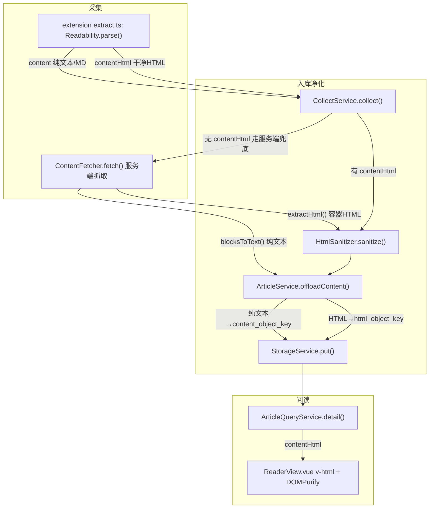
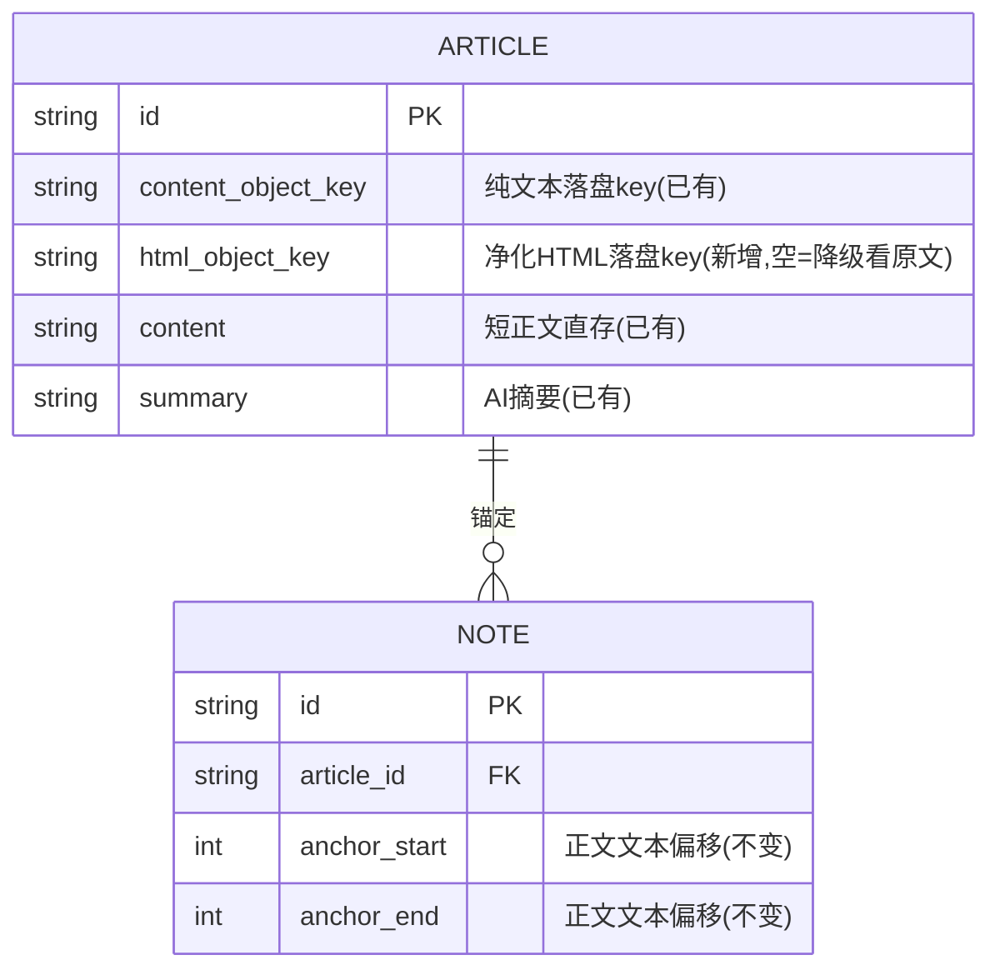
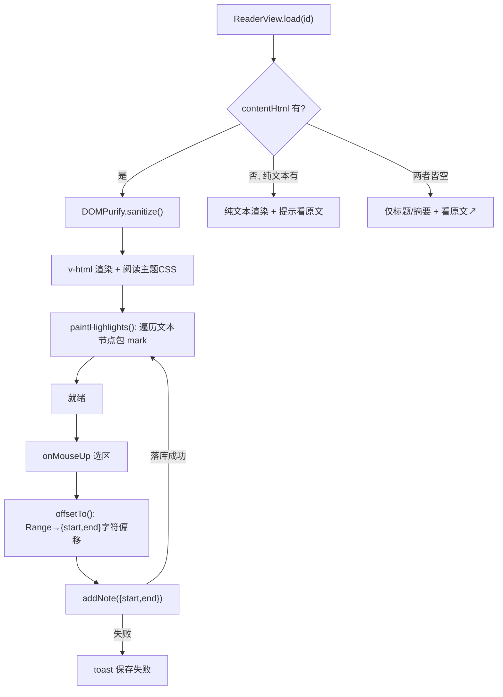

# 沉浸式阅读（SimpRead 式富 HTML 正文）设计

- 日期：2026-07-12
- 状态：设计已确认，待进入实现
- 关联问题：服务端抓取正文被 `blocksToText()` 拍平成纯文本，丢失图片/标题/结构；前端 `{{ text }}` 又转义 HTML，导致阅读页只有纯文本、无排版无图。

## 1. 目标与非目标

**目标**：像 SimpRead 一样，把文章正文以**语义 HTML**（标题/段落/图片/列表/引用/代码块）呈现，套一套干净的阅读主题，做出沉浸式阅读版面。

**非目标（首版明确不做）**：
- 不做像素级复刻原站 CSS（SimpRead 本身也不做）。
- 不下载图片落盘（首版图片引用原址，见 §6）。
- 不做实时重抓（HTML 采集即存，见 §3）。
- 不迁移存量笔记（清库，见 §7）。

## 2. 关键决策速览

| 维度 | 决定 | 理由 |
|---|---|---|
| 还原程度 | Readability 语义 HTML + 自有阅读主题 | SimpRead 真实做法，通用不逐站适配 |
| HTML 来源 | 主：插件保存留 Readability HTML；兜底：服务端 jsoup 抽容器 HTML | 插件在浏览器内、有登录态、无 CORS/iframe 限制 |
| 存储 | 持久化，`html_object_key` 复用 `StorageService` 落盘 | 实时重抓正是知乎 403/微信验证码脆弱路径 |
| 正文渲染 | 统一成富 HTML，替换纯文本渲染 | 用户确认统一，不做双模式 |
| 划线笔记 | 锚点模型 `{start,end}` 不变，只换"高亮渲染"为 DOM 区间包裹；存量清库 | 采集偏移逻辑已在用 Range，可复用 |
| 图片 | `no-referrer` + `data-src` 归一化，不下载不代理 | 实测微信放行无 referer 请求（§6） |

## 3. 整体架构与数据流

> 阅读目的：看清"两条采集路径如何各自产出纯文本+干净 HTML 两份产物，落盘后供阅读渲染"。



各节点实现要点：
- **extension extract.ts**：输入当前页 DOM；输出 `{title, author, content(MD), contentHtml(Readability HTML)}`；依赖 `@mozilla/readability`（已装）；parse 失败返回 null 字段，不抛错。
- **ContentFetcher.fetch()**：输入 URL；同一 `pickContentRoot()` 容器产出纯文本（`blocksToText`）+ HTML（`extractHtml`）；失败行为见既有 `ContentFetchBlockedException` 逻辑。
- **HtmlSanitizer.sanitize()**：输入原始 HTML + baseUri；输出净化 HTML；依赖 jsoup `Safelist`；畸形输入返回空串（降级），不抛错。
- **ArticleService.offloadContent()**：纯文本与 HTML 各自落盘、各记一个 object_key；HTML 落盘失败记 `lastError` 不阻断纯文本主流程。
- **ReaderView.vue**：输入 `contentHtml`；DOMPurify 二次净化后 `v-html` 渲染 + 阅读主题 + 高亮 paint。

## 4. 数据模型

> 阅读目的：看清新增的 `html_object_key` 与既有列的关系。



要点：
- HTML 一律走 `StorageService` 落文件（HTML 通常比纯文本大，不进 `content` 列），`article` 只存 `html_object_key`。
- Flyway 迁移新增 `html_object_key VARCHAR` 列；`Article` 实体加 `htmlObjectKey` 字段，并对 `content`/`nextRetryTime` 同款用 `@TableField(updateStrategy = FieldStrategy.ALWAYS)`（承接上次落盘置 null 修复）。
- `note.anchor_{start,end}` 语义不变，仍是"正文渲染后文本的字符偏移"。

## 5. 服务端组件

### 5.1 HtmlSanitizer（新增，基于 jsoup）

```java
Safelist safe = Safelist.relaxed()
    .addTags("figure", "figcaption")
    .addAttributes("img", "src", "alt")
    .addProtocols("img", "src", "https");
// 流程：1) data-src→src 懒加载归一化  2) Jsoup.clean(html, baseUri, safe)
//       3) 渲染层统一加 no-referrer（见 §6）
```
- 输入：原始 HTML、baseUri（解相对链接）。
- 输出：净化 HTML；剥掉 `script/style/onclick/追踪像素/非 https 图`；保留 h1-6/p/ul/ol/li/blockquote/pre/code/img/a/table/figure。
- 失败行为：畸形 HTML `clean` 返回空串 → 上层当"无 HTML"降级。

### 5.2 ContentFetcher 改造

- `blocksToText()` 保留（继续产纯文本喂 AI）。
- 新增 `extractHtml(Document)`：对 `pickContentRoot()` 选中的容器取 `root.html()` → `HtmlSanitizer.sanitize()`。
- `fetch()` 一次抽取返回文本 + HTML 两份（扩展 `Extracted` record 或新增返回结构）。

### 5.3 入库改造

- `CollectRequest` 新增 `contentHtml`；删除 `domSnapshot`。
- `CollectService.collect()`：有 `contentHtml` 就净化落盘；为空则由服务端抽取补。
- `ArticleService.offloadContent()`：扩一份 HTML 落盘决策（与纯文本同款幂等逻辑）。
- `ArticleQueryService.detail()`：`hydrateContent` 同款从 `html_object_key` 读回 HTML，DTO 加 `contentHtml`。

## 6. 图片处理（实测结论）

对微信 `mmbiz.qpic.cn` 图片实测：

| 请求 | 结果 |
|---|---|
| 无 referer | 200，真图 64KB |
| 跨站 referer | 200，占位图 2KB |
| weixin referer | 200，真图 64KB |

结论：微信只拦"错误 referer"，放行"无 referer"。渲染时给页面/图片加 `referrerpolicy=no-referrer` 即正常加载真图，**无需服务端代理**。首版不下载图片（引用原址）；离线永久化留后续（采集时下载落盘层）。

## 7. 前端渲染与划线笔记

> 阅读目的：看清"渲染 + 划线创建 + 高亮回显"三步在富 HTML 下如何衔接。



各节点实现要点：
- **HasHtml 降级链**：富 HTML → 纯文本（现有样式）→ 仅元信息，任何一层拿不到平滑退下一层，不白屏。
- **DOMPurify.sanitize()**：`v-html` 前二次净化，纵深防御 XSS（服务端已净化一次）。
- **阅读主题 CSS**：新增 `.reader-content` 作用域样式，限宽单栏 + 舒适行高 + 明暗主题；`img{max-width:100%}` + `no-referrer`；复用 `design-tokens`，不污染全局。
- **offsetTo()**：沿用现有 `Range.toString().length` 算文本偏移（HTML 稳定故偏移可复现），采集逻辑基本不改。
- **paintHighlights()**：渲染后遍历 `.r-body` 文本节点，把落在 `[start,end)` 的文本节点包 `<mark>`（替代旧的字符串 slice 高亮）。

## 8. 降级、错误处理、测试

**降级**：见 §7 flowchart HasHtml 三分支。

**错误处理**：
- 净化失败 → 空串降级，不抛错阻断入库。
- HTML 落盘失败 → 记 `lastError`，不影响纯文本 + AI 摘要主流程。
- 前端 `v-html` → DOMPurify + `no-referrer` 双保险。

**测试**：
- `HtmlSanitizerTest`：脚本/事件/追踪像素被剥、结构标签保留、`data-src→src`、只留 https 图。
- `ContentFetcherTest`：微信 `#js_content` 样例抽出结构 HTML（复用现有夹具）。
- 端到端：真实微信文章采集→净化→落盘→渲染（test 目录先验证，同上次抓取修复的模式）。
- 前端：`paintHighlights` 给定 `{start,end}` 在渲染后 DOM 正确包 `<mark>`。

## 9. 清理与迁移动作

- 清空 `note` 表（存量笔记锚点作废）。
- 删除 `CollectRequest.domSnapshot` 及插件里对应产出。
- 手上两篇历史微信文章：重跑抽取补 `html_object_key`，或删除后用插件重存。

## 10. 承接上次会话的既有改动

本设计基于上次会话已合并入工作区（未提交）的抓取修复：`ContentFetchBlockedException`、微信验证码 `unwrapWechatCaptcha`、`FieldStrategy.ALWAYS` 落盘置 null 修复、`ArticleProcessor` 短内容判失败。实现时在其之上叠加，勿回退。
