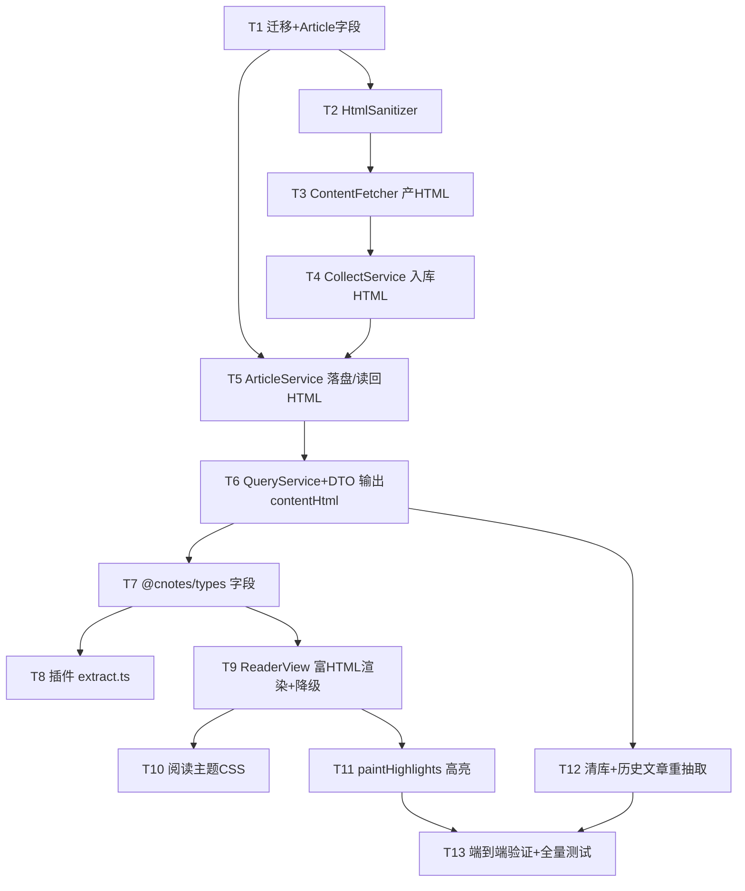

# 沉浸式阅读 实现计划

> **For Claude:** REQUIRED SUB-SKILL: 用 superpowers:executing-plans 逐任务执行本计划。
> **执行阶段派发的每个 subagent 必须显式传 `model: "sonnet"`（phased-dev 硬性规则）。**
> **house rule:未经用户允许不得 `git commit` / `git push`；下方 commit 步骤在获批后执行。**

**Goal:** 让文章正文以 SimpRead 式语义 HTML（保留标题/段落/图片/列表/引用/代码块）+ 干净阅读主题渲染，做出沉浸式阅读版面。

**Architecture:** 采集即产出「纯文本（喂 AI/笔记）+ 净化 HTML（供渲染）」两份产物；HTML 走 `StorageService` 落盘、`article.html_object_key` 记键；`ReaderView` 用 `v-html`+DOMPurify 渲染并 DOM 区间上色高亮。基于上次会话已合并的抓取修复叠加（勿回退 `ContentFetchBlockedException` / `unwrapWechatCaptcha` / `FieldStrategy.ALWAYS`）。

**Tech Stack:** Java 21 / Spring Boot / MyBatis-Plus / jsoup（含 `Safelist` 净化）/ Flyway；Vue 3 / TypeScript / DOMPurify / @mozilla/readability（插件）。

**设计依据:** `docs/plans/2026-07-12-immersive-reader-design.md`

---

## 任务依赖

> 阅读目的:看清任务顺序与并行边界,后端数据链先行,前端渲染依赖 DTO 字段就绪。



---

## 阶段 A：服务端数据与净化基础

### Task 1: 新增 `html_object_key` 迁移与实体字段

**Files:**
- Create: `server/src/main/resources/db/migration/mysql/V9__article_html_object_key.sql`
- Create: `server/src/main/resources/db/migration/h2/V9__article_html_object_key.sql`
- Modify: `server/src/main/java/com/cnotes/article/entity/Article.java`

**Step 1: 写 mysql 迁移**
```sql
-- V9:沉浸式阅读——净化后正文 HTML 落盘;article 旁加 html_object_key 指向存储 key。
-- HTML 一律落盘(不进 content 列);取详情按 key 读回,空=无 HTML 走降级看原文。
ALTER TABLE article ADD COLUMN html_object_key VARCHAR(255) DEFAULT NULL
    COMMENT '净化正文 HTML 落盘 key;空=无 HTML' AFTER content_object_key;
```

**Step 2: 写 h2 迁移(测试库)**
```sql
-- V9:净化后正文 HTML 落盘 key。
ALTER TABLE article ADD COLUMN html_object_key VARCHAR(255) DEFAULT NULL;
```

**Step 3: Article 加字段** —— 落盘键 + 承载 HTML 的瞬态字段(不建列)：
```java
private String contentObjectKey;   // 已有
@TableField(updateStrategy = FieldStrategy.ALWAYS)   // 落盘置空需真正写 NULL
private String htmlObjectKey;       // 新增:净化 HTML 落盘 key
@TableField(exist = false)          // 新增:瞬态,承载入库前/读回后的 HTML,不持久化到列
private String contentHtml;
```

**Step 4: 编译验证**
Run: `cd server && ./gradlew compileJava -q`
Expected: 无输出(成功)

**Step 5: Commit（获批后）**
```bash
git add server/src/main/resources/db/migration server/src/main/java/com/cnotes/article/entity/Article.java
git commit -m "feat(reader): 新增 html_object_key 迁移与实体字段"
```

---

### Task 2: `HtmlSanitizer`（jsoup Safelist 净化）

**Files:**
- Create: `server/src/main/java/com/cnotes/extract/HtmlSanitizer.java`
- Test: `server/src/test/java/com/cnotes/extract/HtmlSanitizerTest.java`

**Step 1: 写失败测试**
```java
package com.cnotes.extract;

import org.junit.jupiter.api.Test;
import static org.assertj.core.api.Assertions.assertThat;

class HtmlSanitizerTest {
    private final HtmlSanitizer s = new HtmlSanitizer();

    @Test void stripsScriptAndEventHandlers() {
        String out = s.sanitize("<p onclick=\"x()\">hi</p><script>evil()</script>", "https://e.com");
        assertThat(out).contains("hi").doesNotContain("script").doesNotContain("onclick");
    }

    @Test void keepsStructuralTagsAndImages() {
        String html = "<h2>标题</h2><p>段落</p><ul><li>项</li></ul>"
            + "<blockquote>引</blockquote><pre><code>code</code></pre>"
            + "";
        String out = s.sanitize(html, "https://e.com");
        assertThat(out).contains("<h2").contains("<ul").contains("<blockquote")
            .contains("<pre").contains("", "https://e.com");
        assertThat(out).contains("src=\"https://e.com/lazy.png\"").doesNotContain("data-src");
    }

    @Test void dropsNonHttpsImage() {
        String out = s.sanitize("", "https://e.com");
        assertThat(out).doesNotContain("x.png").contains("y.png");
    }

    @Test void malformedReturnsEmptyNotThrow() {
        assertThat(s.sanitize(null, "https://e.com")).isEmpty();
        assertThat(s.sanitize("", "https://e.com")).isEmpty();
    }
}
```

**Step 2: 运行验证失败**
Run: `cd server && ./gradlew test --tests "com.cnotes.extract.HtmlSanitizerTest" -q`
Expected: 编译失败(HtmlSanitizer 不存在)

**Step 3: 实现**
```java
package com.cnotes.extract;

import org.jsoup.Jsoup;
import org.jsoup.nodes.Document;
import org.jsoup.safety.Safelist;
import org.springframework.stereotype.Service;

/**
 * 正文 HTML 净化:保留语义结构标签+图片,剥离脚本/样式/事件/追踪像素/非 https 图。
 * 供沉浸式阅读渲染;失败(畸形/空)返回空串,由上层降级,绝不抛错阻断入库。
 */
@Service
public class HtmlSanitizer {

    private static Safelist safelist() {
        return Safelist.relaxed()
            .addTags("figure", "figcaption")
            .addAttributes("img", "src", "alt")
            .removeProtocols("img", "src", "http")   // 只留 https 图(含 mmbiz.qpic.cn)
            .addProtocols("img", "src", "https");
    }

    /** data-src→src 懒加载归一化后按 Safelist 净化;baseUri 用于解析相对链接。 */
    public String sanitize(String html, String baseUri) {
        if (html == null || html.isBlank()) return "";
        try {
            Document dirty = Jsoup.parse(html, baseUri == null ? "" : baseUri);
            dirty.select("img[data-src]").forEach(img -> {
                if (img.attr("src").isBlank()) img.attr("src", img.attr("data-src"));
                img.removeAttr("data-src");
            });
            return Jsoup.clean(dirty.body().html(), baseUri == null ? "" : baseUri, safelist());
        } catch (Exception e) {
            return "";
        }
    }
}
```

**Step 4: 运行验证通过**
Run: `cd server && ./gradlew test --tests "com.cnotes.extract.HtmlSanitizerTest" -q`
Expected: PASS（5 个用例）

**Step 5: Commit（获批后）**
```bash
git add server/src/main/java/com/cnotes/extract/HtmlSanitizer.java server/src/test/java/com/cnotes/extract/HtmlSanitizerTest.java
git commit -m "feat(reader): 新增 HtmlSanitizer 正文 HTML 净化"
```

---

### Task 3: `ContentFetcher` 产出净化 HTML（扩 `Extracted` record）

**Files:**
- Modify: `server/src/main/java/com/cnotes/extract/ContentFetcher.java`
- Modify: `server/src/test/java/com/cnotes/extract/ContentFetcherTest.java`
- Modify（连带修构造）: `server/src/test/java/com/cnotes/worker/ArticleProcessorTest.java`

**Step 1: 写失败测试**（追加到 `ContentFetcherTest`，注意 fetcher 构造需注入 sanitizer）
```java
// 类顶部构造改为:
private final HtmlSanitizer sanitizer = new HtmlSanitizer();
private final ContentFetcher fetcher = new ContentFetcher(noHeadless, 200, sanitizer);

@Test
void extractHtmlPreservesStructureAndImg() {
    String html = "<html><body><div id=\"js_content\">"
        + "<h2>小标题</h2><p>正文段落,足够长以通过阈值判断的占位文本内容。</p>"
        + ""
        + "</div></body></html>";
    ContentFetcher.Extracted ex = fetcher.extractHtml("https://mp.weixin.qq.com/s/a", html);
    assertThat(ex.html()).contains("<h2").contains(""+fetched+"</p>"`；构造 `ContentFetcher` 的地方若直接 new 也补 sanitizer（该文件用 `@MockitoBean ContentFetcher`，通常无需 new，确认即可）。

**Step 5: 运行验证通过**
Run: `cd server && ./gradlew test --tests "com.cnotes.extract.*" --tests "com.cnotes.worker.*" -q`
Expected: PASS

**Step 6: Commit（获批后）**
```bash
git add server/src/main/java/com/cnotes/extract/ContentFetcher.java server/src/test/java/com/cnotes/extract/ContentFetcherTest.java server/src/test/java/com/cnotes/worker/ArticleProcessorTest.java
git commit -m "feat(reader): ContentFetcher 抽取同时产出净化 HTML"
```

---

## 阶段 B：服务端入库与读取

### Task 4: `CollectRequest.contentHtml` + `CollectService` 净化设值

**Files:**
- Modify: `server/src/main/java/com/cnotes/collect/dto/CollectRequest.java`
- Modify: `server/src/main/java/com/cnotes/collect/CollectService.java`

**Step 1: 请求 DTO 加字段、删 domSnapshot**
```java
private String content;       // 插件本地 Readability 提取的纯文本/MD
private String contentHtml;   // 新增:插件 Readability 干净 HTML(供沉浸式渲染)
// 删除 domSnapshot（不再使用）
private String sourceType;
```

**Step 2: `CollectService.collect()` 设 HTML（插件路径,净化后放瞬态字段）**
在 `a.setContent(req.getContent());` 之后加：
```java
if (req.getContentHtml() != null && !req.getContentHtml().isBlank()) {
    a.setContentHtml(sanitizer.sanitize(req.getContentHtml(), req.getUrl()));
}
```
构造注入 `HtmlSanitizer sanitizer`（`@RequiredArgsConstructor` 加 final 字段即可）。

**Step 3: 编译**
Run: `cd server && ./gradlew compileJava -q`
Expected: 无输出

**Step 4: Commit（获批后）**
```bash
git add server/src/main/java/com/cnotes/collect
git commit -m "feat(reader): CollectRequest 增 contentHtml 并净化入库,移除 domSnapshot"
```

---

### Task 5: `ArticleService` HTML 落盘与读回

**Files:**
- Modify: `server/src/main/java/com/cnotes/article/ArticleService.java`
- Test: `server/src/test/java/com/cnotes/article/ArticleServiceHtmlTest.java`

**Step 1: 写失败测试**（复用现有 storage mock 模式，参照仓库既有 ArticleService 测试）
```java
package com.cnotes.article;

import com.cnotes.article.entity.Article;
import com.cnotes.article.mapper.ArticleMapper;
import com.cnotes.storage.StorageService;
import org.junit.jupiter.api.Test;
import static org.assertj.core.api.Assertions.assertThat;
import static org.mockito.Mockito.*;

class ArticleServiceHtmlTest {
    private final ArticleMapper mapper = mock(ArticleMapper.class);
    private final StorageService storage = mock(StorageService.class);
    private final ArticleService svc = new ArticleService(mapper, storage, 20000);

    @Test void offloadHtmlWritesStorageAndSetsKey() {
        Article a = new Article();
        a.setContentHtml("<p>正文HTML</p>");
        svc.offloadHtml(a);
        verify(storage).put(anyString(), eq("<p>正文HTML</p>"));
        assertThat(a.getHtmlObjectKey()).isNotBlank();
        assertThat(a.getContentHtml()).isNull();   // 落盘后清瞬态
    }

    @Test void hydrateHtmlReadsBackByKey() {
        Article a = new Article();
        a.setHtmlObjectKey("k1");
        when(storage.get("k1")).thenReturn("<p>回读</p>");
        svc.hydrateHtml(a);
        assertThat(a.getContentHtml()).isEqualTo("<p>回读</p>");
    }
}
```

**Step 2: 运行验证失败**
Run: `cd server && ./gradlew test --tests "com.cnotes.article.ArticleServiceHtmlTest" -q`
Expected: 编译失败（offloadHtml/hydrateHtml 不存在）

**Step 3: 实现**（HTML 一律落盘,无阈值；save/update 连带调用）
```java
/** HTML 落盘(幂等):已落盘(html_object_key 非空)仅清瞬态;否则落盘并记 key。HTML 一律落盘不看阈值。 */
public void offloadHtml(Article a) {
    if (a.getHtmlObjectKey() != null) { a.setContentHtml(null); return; }
    String h = a.getContentHtml();
    if (h == null || h.isBlank()) return;
    String key = UUID.randomUUID().toString().replace("-", "");
    storageService.put(key, h);
    a.setHtmlObjectKey(key);
    a.setContentHtml(null);
}

/** 取详情:有 html_object_key 则从存储读回 HTML 填瞬态字段。 */
public void hydrateHtml(Article a) {
    if (a == null || a.getHtmlObjectKey() == null) return;
    String h = storageService.get(a.getHtmlObjectKey());
    if (h != null) a.setContentHtml(h);
}
```
并在 `save`/`update` 里追加：
```java
public void save(Article a)   { offloadContent(a); offloadHtml(a); articleMapper.insert(a); }
public void update(Article a) { offloadContent(a); offloadHtml(a); articleMapper.updateById(a); }
```

**Step 4: 运行验证通过**
Run: `cd server && ./gradlew test --tests "com.cnotes.article.ArticleServiceHtmlTest" -q`
Expected: PASS

**Step 5: Commit（获批后）**
```bash
git add server/src/main/java/com/cnotes/article/ArticleService.java server/src/test/java/com/cnotes/article/ArticleServiceHtmlTest.java
git commit -m "feat(reader): ArticleService 正文 HTML 落盘与读回"
```

---

### Task 6: 详情输出 `contentHtml`

**Files:**
- Modify: `server/src/main/java/com/cnotes/article/dto/ArticleDetailDto.java`
- Modify: `server/src/main/java/com/cnotes/article/ArticleQueryService.java`

**Step 1: DTO 加字段**
```java
private String content;
private String contentHtml;   // 新增:净化后正文 HTML(沉浸式渲染)
private List<String> keyPoints;
```

**Step 2: `detail()` 读回并映射**
在 `articleService.hydrateContent(a);` 之后加 `articleService.hydrateHtml(a);`，并在 DTO 组装处加：
```java
d.setContentHtml(a.getContentHtml());
```

**Step 3: 编译 + 全量测试**
Run: `cd server && ./gradlew test -q`
Expected: PASS（全绿）

**Step 4: Commit（获批后）**
```bash
git add server/src/main/java/com/cnotes/article
git commit -m "feat(reader): 详情接口输出 contentHtml"
```

---

## 阶段 C：前端类型与插件

### Task 7: `@cnotes/types` 增 `contentHtml`、删 `domSnapshot`

**Files:**
- Modify: `frontend/packages/types/src/index.ts`

**Step 1: 改类型**
```ts
export interface ArticleDetail extends ArticleCard {
  url?: string;
  content?: string;
  contentHtml?: string | null;   // 新增
  keyPoints: string[];
}

export interface CollectRequest {
  url: string;
  title?: string | null;
  author?: string | null;
  content?: string | null;
  contentHtml?: string | null;   // 新增
  // 删除 domSnapshot
  sourceType?: SourceType;
}
```

**Step 2: 类型检查**
Run: `cd frontend && pnpm -C packages/types build`（或仓库既定 typecheck 命令）
Expected: 无类型错误

**Step 3: Commit（获批后）**
```bash
git add frontend/packages/types/src/index.ts
git commit -m "feat(reader): types 增 contentHtml 移除 domSnapshot"
```

---

### Task 8: 插件 `extract.ts` 产出 `contentHtml`

**Files:**
- Modify: `frontend/apps/extension/src/content/extract.ts`

**Step 1: 改 extract()**
```ts
const parsed = new Readability(docClone).parse();
const turndown = new TurndownService({ headingStyle: 'atx', codeBlockStyle: 'fenced' });
const content = parsed?.content ? turndown.turndown(parsed.content) : '';

return {
  url: location.href,
  title: parsed?.title || document.title || null,
  author: parsed?.byline || null,
  content: content || null,
  contentHtml: parsed?.content || null,   // ★ Readability 干净 HTML,供沉浸式渲染
  sourceType: 'browser',
  // 删除 domSnapshot
};
```

**Step 2: 类型检查/构建插件**
Run: `cd frontend && pnpm -C apps/extension build`（或既定命令）
Expected: 构建通过（`turndown` 仍用于 content，保留依赖）

**Step 3: Commit（获批后）**
```bash
git add frontend/apps/extension/src/content/extract.ts
git commit -m "feat(reader): 插件保存时带出 Readability 干净 HTML"
```

---

## 阶段 D：前端阅读渲染与高亮

### Task 9: 装 DOMPurify + `ReaderView` 富 HTML 渲染与降级

**Files:**
- Modify: `frontend/apps/web/package.json`（加依赖）
- Modify: `frontend/apps/web/src/views/ReaderView.vue`

**Step 1: 安装依赖**
Run: `cd frontend && pnpm -C apps/web add dompurify && pnpm -C apps/web add -D @types/dompurify`
Expected: 安装成功

**Step 2: ReaderView 正文区改富 HTML 渲染 + 降级**
把 `.r-body` 的 `segments` 纯文本渲染替换为：
```vue
<script setup lang="ts">
import DOMPurify from 'dompurify';
// ...
const safeHtml = computed(() =>
  article.value?.contentHtml
    ? DOMPurify.sanitize(article.value.contentHtml, { ADD_ATTR: ['referrerpolicy'] })
    : '',
);
const hasHtml = computed(() => !!safeHtml.value);
</script>

<template>
  <!-- 富 HTML(主路径) -->
  <div v-if="hasHtml" ref="bodyEl" class="r-body reader-content" v-html="safeHtml" @mouseup="onMouseUp"></div>
  <!-- 纯文本降级 -->
  <div v-else-if="article?.content" class="r-body reader-plain" @mouseup="onMouseUp">
    <p class="degrade-tip">未能提取版式,以下为纯文本;<a :href="article.url" target="_blank" rel="noopener">看原文 ↗</a></p>
    <template v-for="(seg, i) in segments" :key="i">
      <mark v-if="seg.noteId" class="hl" @click="emit('openIdeas')">{{ seg.text }}</mark>
      <template v-else>{{ seg.text }}</template>
    </template>
  </div>
  <!-- 仅元信息降级 -->
  <div v-else class="r-body"><p>暂无可读正文,<a :href="article?.url" target="_blank" rel="noopener">看原文 ↗</a></p></div>
</template>
```

**Step 3: 页面级 no-referrer**（`index.html` 加 `<meta name="referrer" content="no-referrer">`，或渲染后给 img 批量加 referrerpolicy，见 T11 paint 同批处理）
Run: 加到 `frontend/apps/web/index.html` 的 `<head>`。

**Step 4: 本地起 web 手测**
Run: `cd frontend && pnpm -C apps/web dev`，打开一篇有 contentHtml 的文章
Expected: 正文带标题/段落/图片渲染；无 contentHtml 时降级纯文本。

**Step 5: Commit（获批后）**
```bash
git add frontend/apps/web/package.json frontend/apps/web/src/views/ReaderView.vue frontend/apps/web/index.html
git commit -m "feat(reader): ReaderView 富 HTML 渲染 + 三层降级"
```

---

### Task 10: 阅读主题样式 `.reader-content`

**Files:**
- Modify: `frontend/apps/web/src/styles.css`（或 ReaderView `<style scoped>`）

**Step 1: 加作用域阅读主题**
```css
.reader-content { max-width: 720px; margin: 0 auto; line-height: 1.8; font-size: 17px; }
.reader-content h1, .reader-content h2, .reader-content h3 { line-height: 1.35; margin: 1.6em 0 .6em; font-weight: 700; }
.reader-content p { margin: 1em 0; }
.reader-content img { max-width: 100%; height: auto; display: block; margin: 1em auto; border-radius: 6px; }
.reader-content blockquote { margin: 1em 0; padding: .4em 1em; border-left: 3px solid var(--border, #ddd); color: var(--muted, #666); }
.reader-content pre { overflow-x: auto; padding: 1em; border-radius: 6px; background: var(--code-bg, #f6f8fa); }
.reader-content ul, .reader-content ol { padding-left: 1.4em; margin: 1em 0; }
.reader-content mark.hl { background: #fff3a3; cursor: pointer; }
@media (prefers-color-scheme: dark) {
  .reader-content pre { background: #1e1e1e; }
  .reader-content mark.hl { background: #6b5b00; color: inherit; }
}
```

**Step 2: 手测明暗两态**
Expected: 限宽单栏、舒适行高、图片自适应、代码块横向滚动、明暗切换正常。

**Step 3: Commit（获批后）**
```bash
git add frontend/apps/web/src
git commit -m "style(reader): 沉浸式阅读主题样式"
```

---

### Task 11: `paintHighlights` DOM 区间高亮 + 选区创建复用

**Files:**
- Modify: `frontend/apps/web/src/views/ReaderView.vue`

**Step 1: 删旧 `segments` 高亮逻辑对富 HTML 的依赖**，改为渲染后按 `{start,end}` 上色。加入：
```ts
// 遍历 .r-body 文本节点,把落在各 note [start,end) 偏移区间的文本包 <mark>。
function paintHighlights() {
  const body = bodyEl.value;
  const art = article.value;
  if (!body || !art) return;
  // 先清旧 mark(解包)
  body.querySelectorAll('mark.hl').forEach((m) => {
    const parent = m.parentNode!;
    while (m.firstChild) parent.insertBefore(m.firstChild, m);
    parent.removeChild(m);
    parent.normalize();
  });
  const ns = notesForArticle(art.id)
    .filter((n) => n.anchor && n.anchor.start < n.anchor.end)
    .sort((a, b) => b.anchor!.start - a.anchor!.start); // 逆序上色,避免偏移漂移
  for (const n of ns) wrapRange(body, n.anchor!.start, n.anchor!.end, n.id);
  // 图片补 no-referrer(纵深)
  body.querySelectorAll('img').forEach((im) => im.setAttribute('referrerpolicy', 'no-referrer'));
}

// 用全局文本偏移在 body 内定位并包裹 <mark>。
function wrapRange(body: HTMLElement, start: number, end: number, noteId: string) {
  const walker = document.createTreeWalker(body, NodeFilter.SHOW_TEXT);
  let pos = 0, sNode: Text | null = null, sOff = 0, eNode: Text | null = null, eOff = 0;
  let t: Text | null;
  while ((t = walker.nextNode() as Text | null)) {
    const len = t.data.length;
    if (!sNode && start < pos + len) { sNode = t; sOff = start - pos; }
    if (!eNode && end <= pos + len) { eNode = t; eOff = end - pos; break; }
    pos += len;
  }
  if (!sNode || !eNode) return;
  const range = document.createRange();
  range.setStart(sNode, sOff);
  range.setEnd(eNode, eOff);
  const mark = document.createElement('mark');
  mark.className = 'hl';
  mark.addEventListener('click', () => emit('openIdeas'));
  try { range.surroundContents(mark); } catch { /* 跨元素边界选区,忽略该高亮 */ }
}
```

**Step 2: 渲染后与 notes 变化时触发上色**
```ts
watch([safeHtml, () => notesForArticle(article.value?.id ?? '').length],
  () => nextTick(paintHighlights));
```
`onMouseUp`/`offsetTo`/`saveNote` 现有逻辑保留（偏移采集不变）；`saveNote` 成功后由上面的 watch 自动重绘。

**Step 3: 手测**
- 选中富 HTML 中一段 → 划线记想法 → 保存 → 该段高亮。
- 刷新后高亮按存储 `{start,end}` 复现。
Expected: 高亮正确落在所选文本；跨图片/跨块的非法选区被安全忽略、不报错。

**Step 4: Commit（获批后）**
```bash
git add frontend/apps/web/src/views/ReaderView.vue
git commit -m "feat(reader): 富 HTML 下 DOM 区间划线高亮"
```

---

## 阶段 E：清理与验证

### Task 12: 清空存量笔记 + 历史微信文章重抽取

**Files:**
- 运维操作（生产库 + 触发重处理），非代码

**Step 1: 清空 note 表（获批后，生产库直连 SQL；`next_retry_time` 已在上次修复能真正置 NULL）**
```bash
ssh aliyun "mysql -ucnotes -p'<pwd>' cnotes -e \"DELETE FROM note;\""
```

**Step 2: 历史两篇微信文章重抽取**（部署新代码后，置回 pending 让 Worker 重跑，补 `html_object_key`）
```sql
UPDATE article SET status='pending', retry_count=0, next_retry_time=NULL
WHERE url LIKE '%mp.weixin.qq.com%' AND html_object_key IS NULL;
```
说明:此步须在新 jar 部署后执行；知乎那篇维持终态失败不动。

**Step 3: 验证**
```sql
SELECT id, status, html_object_key, CHAR_LENGTH(content) FROM article ORDER BY create_time DESC LIMIT 5;
```
Expected: 微信文章 `html_object_key` 非空。

---

### Task 13: 端到端验证 + 全量测试

**Step 1: 后端全量测试**
Run: `cd server && ./gradlew test -q`
Expected: 全绿

**Step 2: 真实微信文章端到端**（test 目录临时脚本或本地起服务，参照上次抓取修复的验证模式）：采集→净化→落盘→`GET /api/articles/{id}` 返回非空 `contentHtml`→前端渲染带图带排版。

**Step 3: 前端构建 + e2e（若有）**
Run: `cd frontend && pnpm -C apps/web build`
Expected: 构建通过

**Step 4: 部署**（获批后走 `ops/prod-deploy.sh`，与上次抓取修复一并上线）

**Step 5: Commit / 收尾（获批后）**
```bash
git add -A && git commit -m "chore(reader): 沉浸式阅读端到端验证收尾"
```

---

## 验收标准

- 微信文章阅读页呈现标题/段落/图片/列表等结构，套阅读主题，图片正常加载（no-referrer）。
- 无 `contentHtml` 的文章平滑降级纯文本 / 看原文，不白屏。
- 富 HTML 下可划线记想法，高亮按 `{start,end}` 复现；非法跨块选区被安全忽略。
- 后端全量测试绿；`HtmlSanitizer` 剥脚本/留结构/归一化 data-src 全覆盖。
- 存量笔记已清；历史微信文章补上 `html_object_key`。
