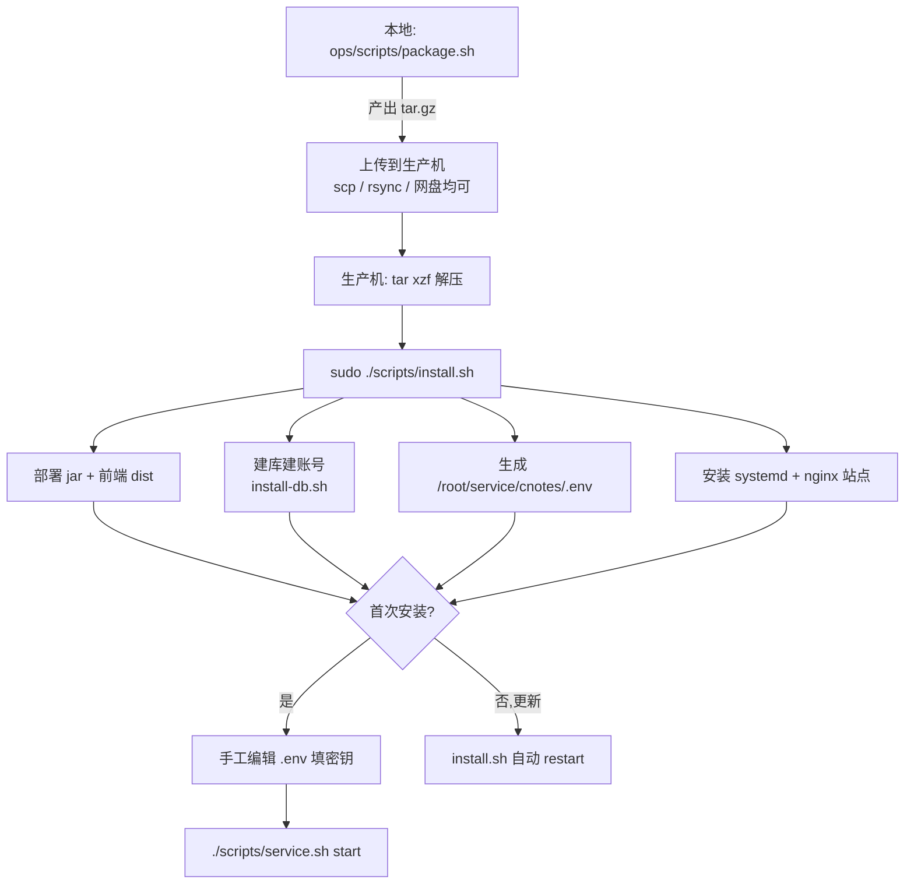

# cnotes 生产部署 —— 解压即用指南

> 前置(生产机需已具备,本包不装):JDK 21、MariaDB 11(或 MySQL 8)、nginx、systemd 发行版(如 Ubuntu)。

> **本文档描述的是当前项目实际使用的部署方式**(部署目录 `/root/service/cnotes`,`User=root`)。仓库里的
> `ops/prod-deploy.sh` + `docs/ops/prod-deploy.md` 是更早期的、从开发机直接 SSH push 到 `/opt/cnotes`
> (`User=cnotes`)的部署流程,目录布局不同,已不再实际使用/验证,请勿混用或参照那一套。

## 部署流程



## 步骤

1. 本地(开发机):`./ops/scripts/package.sh` 产出 `release/cnotes-release-<时间戳>.tar.gz`。
2. 上传到生产机(任意方式,如 scp):
   ```bash
   scp release/cnotes-release-*.tar.gz user@your-server:/tmp/
   ```
3. 生产机解压并安装:
   ```bash
   cd /tmp && tar xzf cnotes-release-*.tar.gz && cd cnotes-release-*
   sudo ./scripts/install.sh
   ```
   `install.sh` 会自动:部署 jar/dist → 建库建账号(MariaDB)→ 生成 `.env` → 装 systemd + nginx。部署目录固定为
   `/root/service/cnotes`,服务进程以 **root** 运行(systemd 单元 `User=root`)——因为部署路径选在了 `/root` 下,
   普通低权账号无法遍历进去,故不再单独建 `cnotes` 系统账号。
4. 首次安装:编辑 `/root/service/cnotes/.env`,补上 `DEEPSEEK_API_KEY` / `ARK_API_KEY` / `JWT_SECRET`(生成方式见文件内注释),然后:
   ```bash
   ./scripts/service.sh start
   ```
5. 验证:
   ```bash
   curl -i http://127.0.0.1:8080/actuator/health
   # 浏览器打开 http://<服务器IP或域名>/ → /login → 注册/登录 → 收件箱
   ```

## 后续更新版本

再次执行 `package.sh` → 上传新包 → `sudo ./scripts/install.sh`(检测到 `.env` 已存在即视为更新:跳过建库、不覆盖 `.env`,只刷新 jar/dist/systemd/nginx 并自动重启)。

## 数据库密码轮换

`install.sh` 只在首次安装(`.env` 不存在)时建库建账号;之后要换 `cnotes` 数据库账号的密码,直接单独重跑:
```bash
DB_PASSWORD=<新密码> sudo ./scripts/install-db.sh
```
`CREATE USER IF NOT EXISTS` + 紧跟的 `ALTER USER IF EXISTS` 保证密码总会被同步,可重复执行。跑完后手工把新密码同步进 `/root/service/cnotes/.env` 的 `SPRING_DATASOURCE_PASSWORD`,再 `./scripts/service.sh restart`。

## 常用运维命令

```bash
./scripts/service.sh status   # 查看服务状态
./scripts/service.sh logs     # 跟踪日志
./scripts/service.sh restart  # 重启
```

## 日志

后端用 Log4j2,标准 Java 落盘规范:控制台输出仍由 systemd 接管进 journald(`./scripts/service.sh logs`
可继续用),同时按天 + 100MB 双触发滚动写文件,gzip 压缩历史,保留最近 30 份;ERROR 级别另落一份独立
文件方便快速排障。

```
/root/service/cnotes/logs/cnotes.log              当前日志
/root/service/cnotes/logs/cnotes-error.log         当前 ERROR 专用日志
/root/service/cnotes/logs/cnotes-2026-07-12-1.log.gz   历史滚动文件(gzip)
```

路径由 `.env` 的 `LOG_PATH` 指定,换目录只需改这一项 + 重启服务。nginx 日志走系统默认路径
`/var/log/nginx/{access,error}.log`,由系统自带 logrotate 管理,不需要额外配置。

## 环境变量覆盖(可选,加在 install.sh 前面)

- `SERVER_NAME=cnotes.example.com sudo ./scripts/install.sh` —— 有域名后指定 nginx server_name(默认 `_` 通配,先用 IP 直接访问)。
- `LISTEN_PORT=38088 sudo ./scripts/install.sh` —— nginx 监听端口,默认 80;云主机安全组/ICP 限制 80/443 时改用自定义端口(记得在安全组里放行同一个端口,访问地址变成 `http://<IP>:38088/`)。
- `SKIP_DB=1 sudo ./scripts/install.sh` —— 首次安装时数据库已自行准备好,跳过建库步骤,`.env` 需手工填数据库连接三项。
- `DB_NAME=xxx DB_USER=xxx DB_PASSWORD=xxx sudo ./scripts/install.sh` —— 首次安装自定义库名/账号/密码,透传给 `install-db.sh`。
- `DB_FORCE_RUN=1 sudo ./scripts/install.sh` —— `.env` 已存在(即更新流程)时仍强制重跑建库,用于数据库被误删但 `.env` 还在的恢复场景。

## 排障

- 服务起不来 → `./scripts/service.sh logs` 或 `journalctl -u cnotes -n 100`,多为 `.env` 缺 `JWT_SECRET`/`DEEPSEEK_API_KEY`,或数据库不可达。
- MariaDB 连接鉴权失败(mysql-connector-j 对接 MariaDB 的已知坑)→ 本包后端驱动仍是 `mysql-connector-j`(未切 `mariadb-java-client`);确认应用账号鉴权插件为 `mysql_native_password`(MariaDB 默认即是)。若报 `caching_sha2_password` 相关错误,用 `install-db.sh` 重建账号,或改用官方 MariaDB 驱动(需改 `server/build.gradle`,本包未含此改动)。
- nginx 404 刷新 → 确认 `/etc/nginx/conf.d/cnotes.conf` 生效,`install.sh` 已自动禁用 Ubuntu 默认站点避免抢占 80 端口。
- 建库失败(unix_socket 报错)→ 显式传 `DB_ADMIN_USER=root DB_ADMIN_PASSWORD=xxx` 走密码登录重跑 `scripts/install-db.sh`。
- 语义簇/深聊无响应 → 确认 `.env` 的 `DEEPSEEK_API_KEY`/`ARK_API_KEY` 已填且有效,`WORKER_SCHEDULING_ENABLED=true`。
